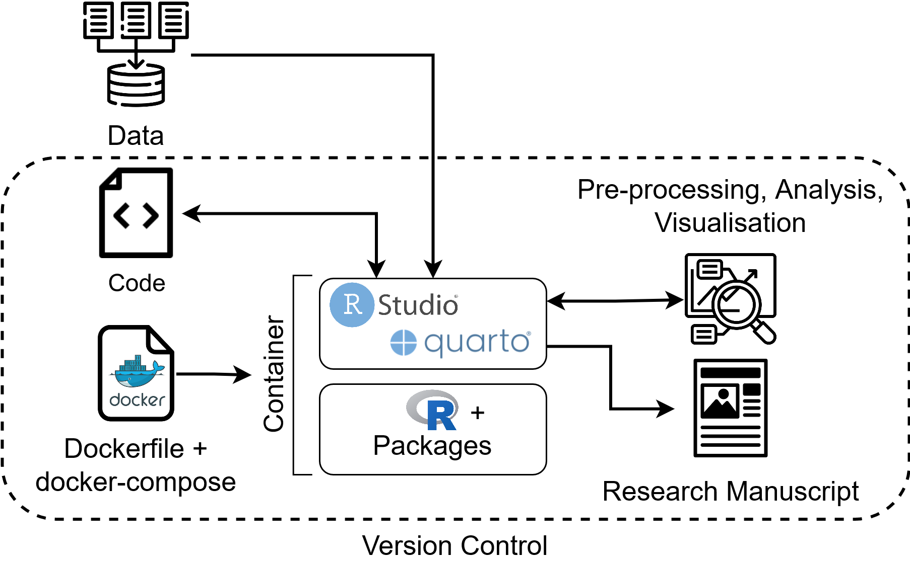
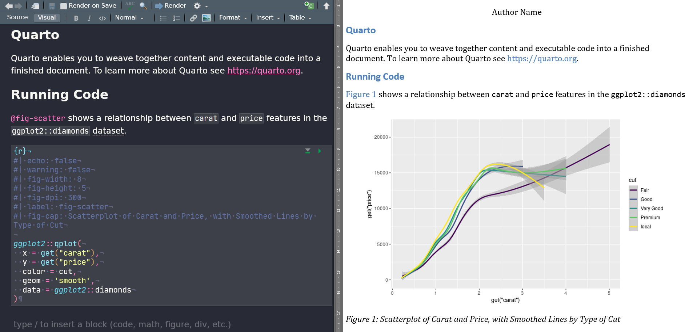
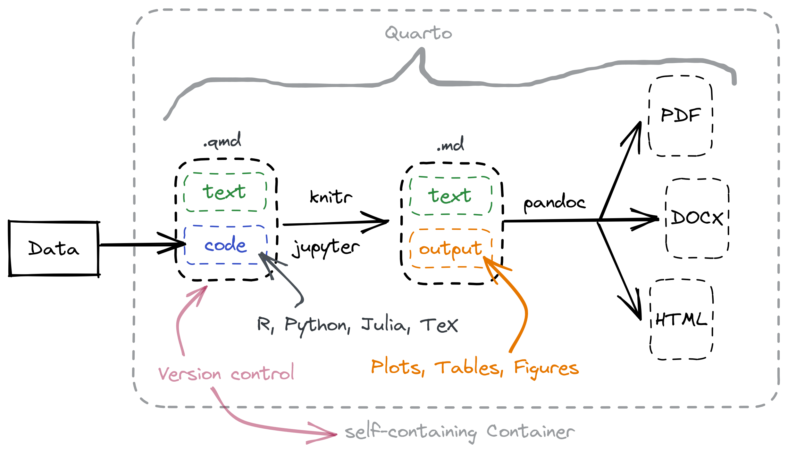

# Reproducible Publishing using Quarto

[](https://doi.org/10.3233/SHTI230064)

## Motivation

Loads of tutorials and literature about reproducible research is available but it turned out that there was no repository (that I know of) that reproducibly maps everything from the beginning (data analysis) to the end (publication). This repo is supposed to offer exactly that:
It should be directly usable without customization, but also provide help to be able to adapt it to your own needs at necessary points.

### Exemplary workflow



Exemplary workflow to ensure reproducibility in data analysis and manuscript writing. The code for pre-processing, the analysis and the presentation of the results in the manuscript (`code`) are version-controlled. The build information of the container for the runtime and development environment (`Dockerfile + docker-compose`) is also version-controlled. The container image is version-controlled as well and stored in a dedicated online repository. The raw data itself is not version controlled via Git.

### RStudio with Quarto documents




RStudio as integrated development environment for writing and compiling quarto documents with code (e.g. R or Python) and text (using Markdown or the visual editor). On the left: RStudio interface for composing the text and code next to each other. On the right: Rendered output document with dynamically incorporated results.

## Furhter readings

Interested in more information? [Find the full paper about this project here](https://ebooks.iospress.nl/doi/10.3233/SHTI230064).

## Preparations

1. Make sure, you have [Docker](https://docs.docker.com/get-docker/) installed
2. Make sure, you have [Git](https://git-scm.com/downloads) installed

## How to use

1. Clone this repository:

    ```bash
    git clone https://github.com/joundso/repub.git
    cd repub
    ```

2. Start the containerized RStudio by running [`start.sh`](./start.sh), or by running:

    ```bash
    cd docker
    docker-compose up -d
    ```

3. Open RStudio in your browser at [`http://127.0.0.1:8080/`](http://127.0.0.1:8080/)
   1. Login with the username `rstudio` and password `pwd`
   2. Open the project `repub.Rproj` in the lower right corner of the file browser
4. Build the manuscript in the upper right part of RStudio: `Build` tab --> `Render Book` button
5. See the result in the included viewer or the file in the [`docs`](./docs/) folder

## Questions?

- Bugs or Feature Requests: <https://github.com/joundso/repub/issues>

## Details

### Literature

For the integration of the sources from the `references.bib` file in the continuous text, permanent citation keys are used.
To dynamically create a `references.bib` file, the Zotero plugin [`Better BibTeX for Zotero`](https://retorque.re/zotero-better-bibtex/) can be used.

1. Installation instructions: <https://retorque.re/zotero-better-bibtex/installation/>
2. Afterwards, the '[automatic export](https://retorque.re/zotero-better-bibtex/installation/preferences/automatic-export/)' function can be used to automatically create and update a `*.bib` file depending on the content in your Zotero instance.
3. One example for the creation of citation keys might be this: `auth.lower.replace(find=".",replace=_)+len+year | veryshorttitle+shortyear`. Information about the citation keys are available [here](https://retorque.re/zotero-better-bibtex/citing/).
4. If necessary, adapt the path to the `.bib` file in [`_quarto.yml`](./_quarto.yml):

    ```yaml
    ## The literature file goes here (use e.g. 
    ## 'Better BibTeX for Zotero' to dynamically create this file):
    bibliography: meta/references.bib
    ```

### Citation styles

There are thousnds of citation styles available for free online: <https://github.com/citation-style-language/styles>
Download the necessary style, store it locally and add the path to the `.csl` file to the [`_quarto.yml`](./_quarto.yml):

```yaml
## Citation styltes from here: https://github.com/citation-style-language/styles
csl: meta/ios-press-books.csl
```

### Outlook

- Next to RStudio for R: Add Jupyter with Python backend to Docker deployment
